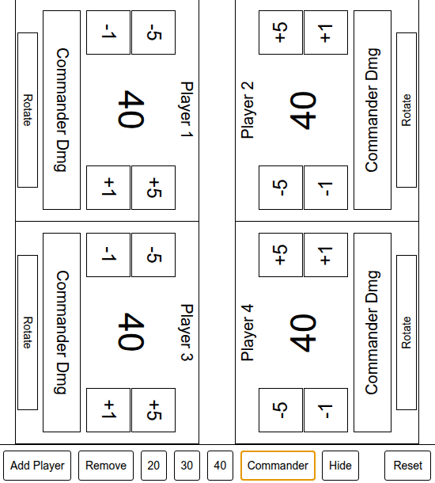

# E-Reader MTG Life Counter

An e-paper-friendly MTG life counter for 2-6 players, optimized for the Tolino Vision 4 HD browser.
It is a standalone HTML app and can run either from a LAN server or from the Android localhost-server APK, which also beginners should be able to install easily.



## Install the APK

Download the latest APK from the project's GitHub Releases page. No build tools are needed if you use a released APK.

### Enable developer mode on Tolino firmware 16.2.0

On the reader, open the search bar and enter this exact code:

```text
112358132fb
```

Follow the on-screen instructions to enable developer mode.

The apk can be copied on the reader as mass storage device and then installed in these developer mode 2nd page. Then reboot and navigate the internal browser (found under the Menu at top left) to http://127.0.0.1:8080/ to open the life counter.


Alternatively, USB debugging can be enabled and the apk installed over adb. For that, on Ubuntu, install `adb`:

```sh
sudo apt install adb
```

And respective apk:

```sh
adb install -r MTG-Life-Counter-v1.0.0.apk
```

Start the local server without reboot:

```sh
adb shell am start -n com.example.mtglifecounter/.MainActivity
```

Open the reader browser through adb:

```sh
adb shell am start -a android.intent.action.VIEW -d http://127.0.0.1:8080/
```

The APK also starts the localhost service after `BOOT_COMPLETED` where the Tolino permits boot receivers. The browser still needs to be opened manually.

While the service runs in the background, the Tolino may show a faint eye icon in the top-right corner. In rare situations the background service may stop; rebooting the Tolino starts it again. While you are using it in the webbrowser, that is not a problem.

## Use Over Wi-Fi

On the computer, run:

```sh
./serve.sh
```

Find the computer's Wi-Fi address with `hostname -I`, then open this URL on the reader:

```text
http://<computer-ip>:8000/
```

Both devices must be connected to the same Wi-Fi network. Use `./serve.sh 8081` or `make server PORT=8081` to select another port.

## Build the APK

The Android project packages the current `index.html` into a debug APK. The APK starts a localhost-only HTTP server on port `8080`; it does not automatically open the browser.

The app targets API 19 for the Tolino while compiling against Platform 33. On Ubuntu Noble, install the Android SDK components and Java with:

```sh
sudo apt install openjdk-21-jdk google-android-platform-33-installer google-android-build-tools-34-installer adb
```

The project uses the SDK at `/usr/lib/android-sdk` through the ignored file `android/local.properties`. Create it from the tracked example:

```sh
cp android/local.properties.example android/local.properties
```

If the SDK is installed elsewhere, edit `android/local.properties` locally without committing it.

The repository uses Python to create a virtual environment and download Gradle locally into ignored `.tools/`; it does not require `/opt` or a system Gradle installation:

```sh
make apk
```

The APK is created at:

```text
android/app/build/outputs/apk/debug/MTG-Life-Counter-v1.0.0.apk
```

The version is controlled by the Makefile and can be changed when building:

```sh
make apk VERSION=1.0.1
```

## Make Targets

```text
make help         Show available targets
make setup        Create Python/Node/Gradle tools locally
make env          Alias for make setup
make server       Start the LAN server
make apk          Build the debug APK
make install-apk  Build and install through adb
make clean        Clean Android build output
```

`make install-apk` installs the locally built debug APK. It does not install a GitHub release APK; install that directly with `adb install -r <release-apk>` as shown above.

Useful overrides:

```sh
make server PORT=8081
make apk GRADLE=./.tools/gradle-8.5/bin/gradle
make install-apk ADB=/path/to/adb
make apk VERSION=1.0.1
```
